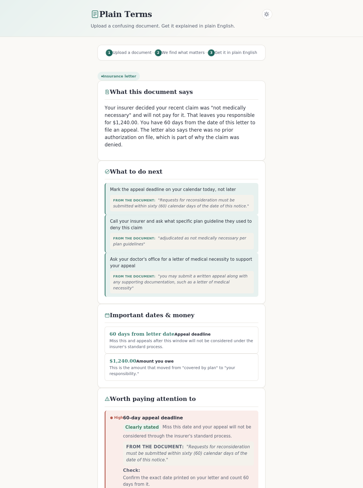

# Plain Terms



Plain Terms reads confusing documents (medical bills, insurance letters, contracts) and explains them in plain language...

# Plain Terms

Plain Terms reads confusing documents (medical bills, insurance letters, contracts) and explains them in plain language. Upload a photo, PDF, Word doc, or text file, and it gives you a summary, a glossary, risk flags, action items, and questions to ask, in English or a few other languages.

## Stack

Plain HTML, CSS and JavaScript on the frontend, one serverless function on the backend (Vercel), and Google's Gemini API for the actual document understanding. No frontend framework.

## Running your own copy

You need a free Gemini API key from https://aistudio.google.com/apikey.

Push this project to a GitHub repo, then import it into Vercel (vercel.com, sign in with GitHub, Add New Project, select the repo, deploy).

The first deploy will fail or error out on decode, because it doesn't have your key yet. In your Vercel project, go to Settings > Environment Variables and add:

```
GEMINI_API_KEY = your key here
```

Then redeploy (adding an env var doesn't apply automatically). After that it should work.

## If something breaks

Open the browser console (F12) and read the actual error.

- "Server is missing GEMINI_API_KEY": the key wasn't added, or you didn't redeploy after adding it
- A model/Gemini error: the app tries three different models automatically if one is busy, so this should be rare. If it still happens, check ai.google.dev/gemini-api/docs/models for current model names
- "Could not reach the AI service": you opened index.html directly as a file instead of the deployed URL
- File too large: 4MB limit, compress the image or use a shorter document

## Notes

Nothing is stored anywhere by this app. Documents are sent to Gemini for processing and discarded after. Google's free tier terms permit them to use that data to improve their models, which is disclosed on the page itself.
